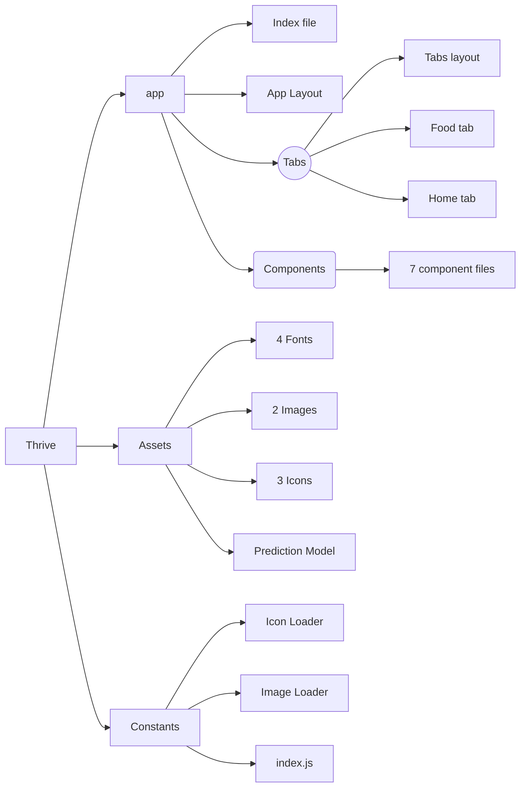
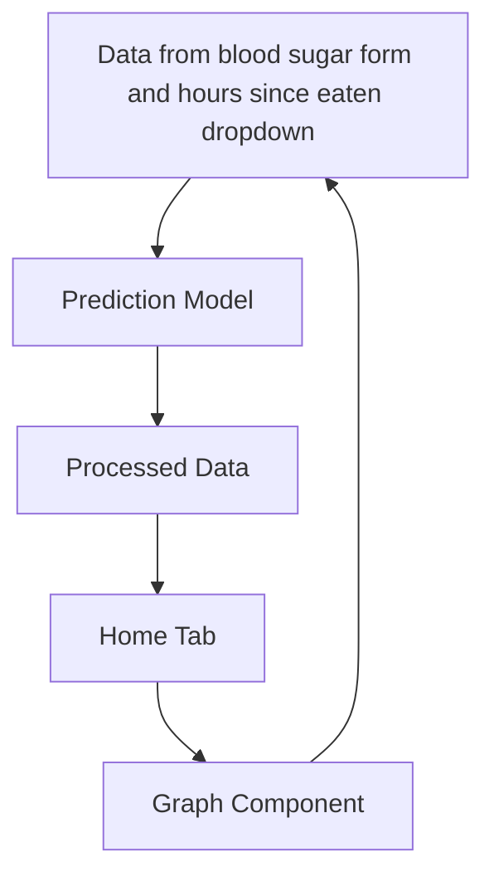
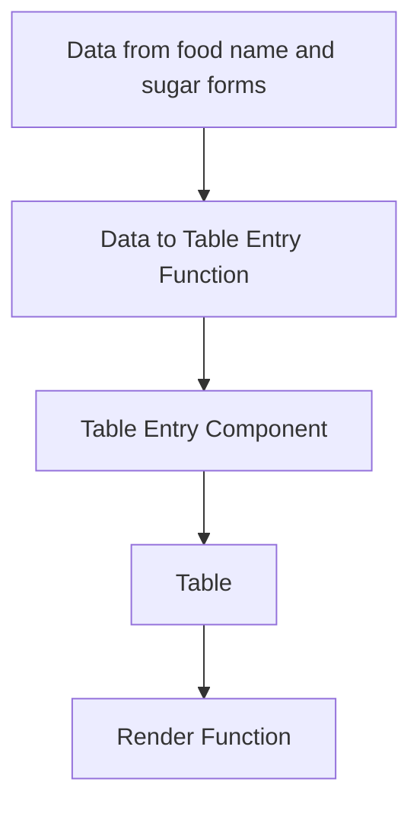

# Thrive
By: Om Patel

Congressional App Challenge 2024 Submission
District: TX-22 (Troy E. Nehls)

# About

Thrive is an app that helps people with diabetes manage their blood sugar levels. It predicts how your levels will change based on your current reading and the time since your last meal using regression-based machine learning. You enter this info, and the app generates a graph showing what your levels might look like over the next few hours. Thrive also tracks your daily sugar intake by letting you log the foods you eat. At the end of each day, it resets, making it easy to track the next day's sugar intake. Thrive simplifies diabetes management, helping you stay informed and in control of your health.

## Inspiration

Thrive was inspired by the rising number of people facing diabetes globally and by my grandfather's experiences and those of friends living with diabetes. With diabetes impacting millions globally, especially in low to middle-income families, the need for accessible management tools became clear. I aimed to create Thrive as a solution to ease the difficulties of managing diabetes by offering accurate blood sugar predictions and simplifying sugar intake tracking. The app integrates regression-based machine learning for future predictions, features an intuitive interface for users of all ages, and fosters community support, ultimately empowering individuals to take control of their diabetes management and improve their quality of life.

## Technical Difficulties / Challenges

While developing Thrive, I faced many challenges. As a first-time app developer, I had to learn how to design and build the app from scratch. Having to learn JavaScript, Tailwind CSS, and Victory Charts XL while working with new libraries and frameworks such as React Native and Expo added to the difficulty, since I needed to understand their features. I also had to figure out a way to record data for the regression model, which took a lot of time since I needed to fast for 12 hours, record my sugar, eat my meal, and fast for another 4 to 5 hours while taking measurements every 30 minutes. Despite these obstacles, each challenge helped me improve, making the satisfaction of seeing Thrive come to life worthwhile.

## Improvements For Version 2.0

If I were to create a 2.0 version of my app, I would focus on improving the prediction model by using more data. Right now, the model is based only on my own blood sugar data, which may reduce its accuracy for different demographics. To make improve it, I would collect data from both diabetic and nondiabetic people. This way, the app could better understand a wider range of blood sugar responses. I would build a base model that updates itself based on the specific data from each user. This means that over time, everyone would have a personalized prediction model saved to their account. Alongside this, I would work on enhancing the user experience. By learning more about React Native and design principles, I could improve the app's interface and usability. My goal would be to create a more intuitive and accessible experience for all users.

## Images

## Tools Used

| TOOLS               |USAGE                          |REASON                         |
|----------------|-------------------------------|-----------------------------|
|React Native	 |`Used to develop app interface`|Used react native so I can publish to all platforms            |
|Visual Studio Code          |`Used as source code editor`            |Used VSCode to make it easy to edit and manage project files            |
|Github|`Used to manage versions and files`|Used Github to keep track of versions and changes|
|Tailwind CSS | `Used to style React Native components`| Used Tailwind CSS for easy inline styling for components
| Victory Native XL|`Used to display graphs for blood sugar levels` | Used Victory Native XL to show blood sugar data in a readable and interactable way
| Desmos|`Used to help with prediction equations and general data representation` | Used to represent and work on the math behind predicting blood sugar

## App Structure

# Data Flow (Prediction)

# Data Flow (Sugar Log)

